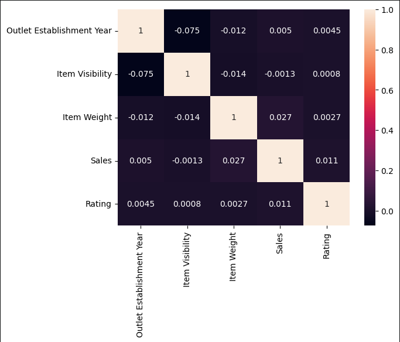
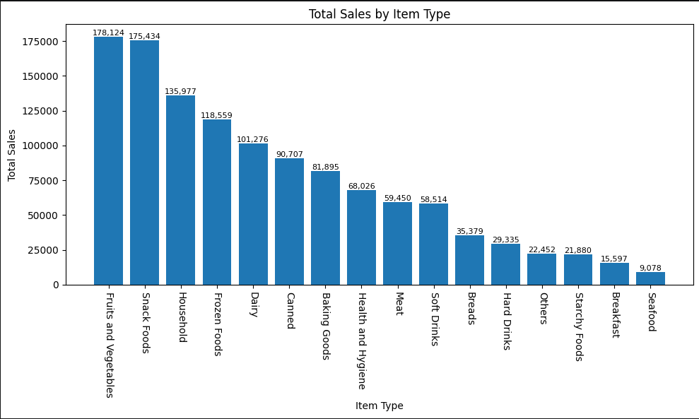
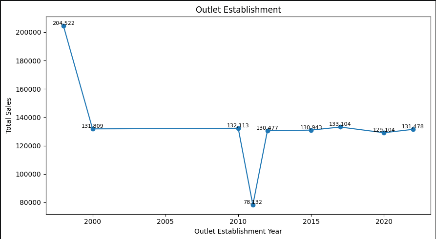

# Blinkit Sales Analysis

## Overview
This project analyzes Blinkit grocery sales data using Python and Pandas to uncover sales trends and business insights.

## Tools Used
- Python
- Pandas
- Matplotlib
- Seaborn
- Jupyter Notebook

---

## Correlation Heatmap

---

## Total Sales by Item Type

---

## Outlet Establishment Analysis

---

## Key Insights

- Fruits and Vegetables generated the highest sales
- Tier 3 outlets contributed maximum revenue
- Regular fat products performed better overall

## Author
Prabha R
